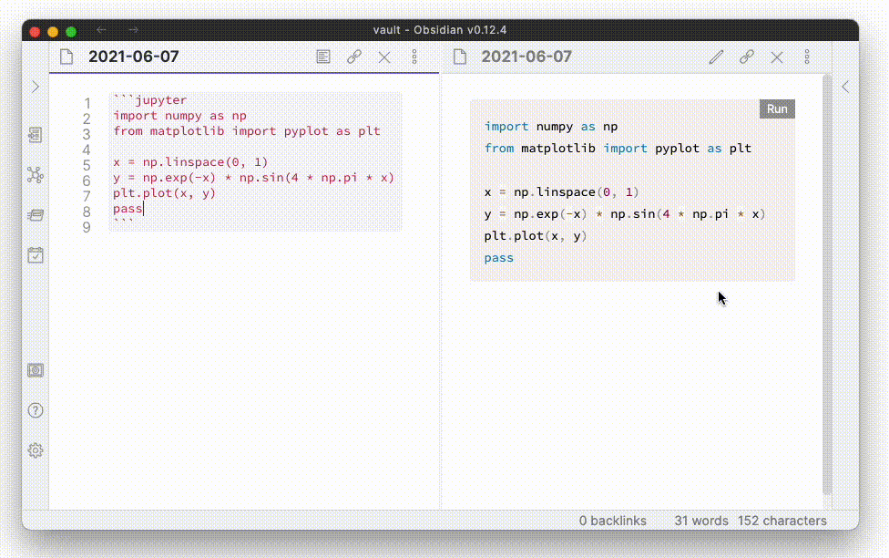

# Obsidian Jupyter Plugin  [](https://github.com/tillahoffmann/obsidian-jupyter/actions/workflows/release.yml) 

This plugin allows python code blocks in fences with `jupyter` language to be executed as Jupyter notebooks.



## Installation

1. Install the plugin via the community plugins settings tab in Obsidian.
2. Specify the python interpreter path in the settings tab of the plugin. If you don't know what your interpreter path is, run `python -c 'import sys; print(sys.executable)'` from the console. The python version should be at least 3.7.
3. Verify that jupyter is installed. If you're unsure, run `pip install jupyter --upgrade` from the console to install the latest version. You can also use the `Install dependencies` button in the settings to install the requirements.

This plugin has been tested with the following python dependencies. If you encounter problems, please update your python dependencies before opening an issue.

```
jupyter==1.0.0
jupyter-client==7.0.2
jupyter-console==6.4.0
jupyter-core==4.7.1
jupyterlab-pygments==0.1.2
jupyterlab-widgets==1.0.1
nbclient==0.5.4
nbconvert==6.1.0
nbformat==5.1.3
notebook=6.4.3
```

## Settings

* Python interpreter: path to the python interpreter used to execute code, e.g. `/usr/bin/python`.
* Setup script: script that is run prior to every execution of a python code block.

The python interpreter can also be specified for each document using YAML frontmatter.

```yaml
---
obsidian-jupyter:
 interpreter: interpreter-path
---
```

## Known issues

* This plugin conflicts with the [banners plugin](https://github.com/noatpad/obsidian-banners) (see [#4](https://github.com/tillahoffmann/obsidian-jupyter/issues/4#issuecomment-913042968) for details).
